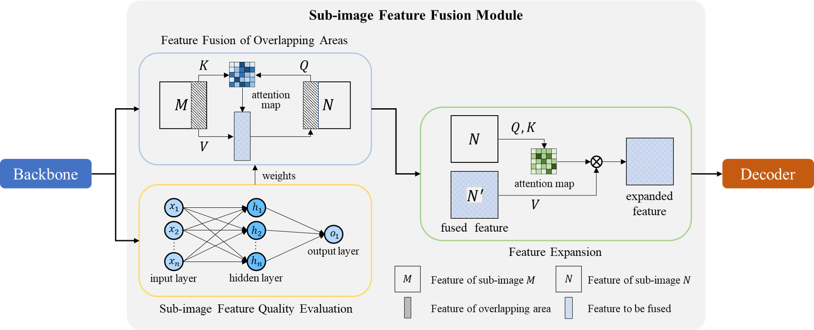

# Road Weather Condition Detection Based on Sub-image Feature Fusion
This is the official implementation of paper, "Road Weather Condition Detection Based on Sub-image Feature Fusion" by Yu-ang Guo, Jianqiang Wang, Guizhen Yu, Chuang Zhang, Gaolei Shi. 

Codes will be made public after the paper is accepted.
